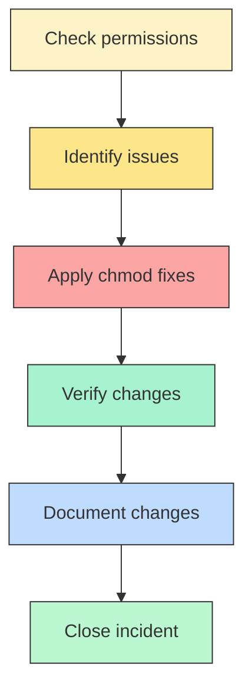

# File Permissions Case Study: Before vs. After

| **File/Directory** | **Before Permissions** | **After Permissions** | **Change Applied** |
|---------------------|------------------------|-----------------------|--------------------|
| `project_k.txt`     | `-rw-rw-rw-`           | `-rw-rw-r--`          | Removed write access for others (`chmod o-w`) |
| `project_m.txt`     | `-rw-r-----`           | `-rw-r-----`          | No change needed (already compliant) |
| `project_r.txt`     | `-rw-rw-r--`           | `-rw-rw-r--`          | No change needed (others had read only) |
| `project_t.txt`     | `-rw-rw-r--`           | `-rw-rw-r--`          | No change needed (others had read only) |
| `.project_x.txt`    | `-rw--w----`           | `-r--r-----`          | Restricted to read-only for user/group (`chmod u=r,g=r,o=`) |
| `drafts/`           | `drwx--x---`           | `drwx------`          | Restricted directory access to owner only (`chmod 700`) |

---

## ✅ Key Takeaways
- **Before:** Several files allowed unauthorized write access (others and group).  
- **After:** Permissions now follow the **principle of least privilege** — only the owner and authorized group have appropriate access.  
- **Impact:** Sensitive research files are protected, hidden files are locked down, and directories are restricted to the correct user.  

---

## Incident Workflow (Flow Diagram)

Below is a Mermaid flowchart illustrating the incident workflow: Check permissions → Identify issues → Apply chmod fixes → Verify → Document.

---

If you'd like, I can also:

- create an `assets/permission_workflow.svg` export of this diagram for embedding in portfolios (good for sites that don't render Mermaid), or
- commit and push these changes to a repository branch and open a suggested commit message.

Which of these would you like me to do next?
